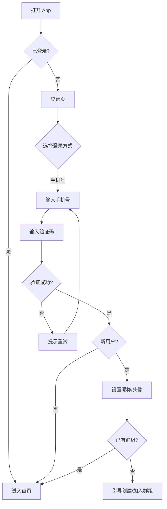
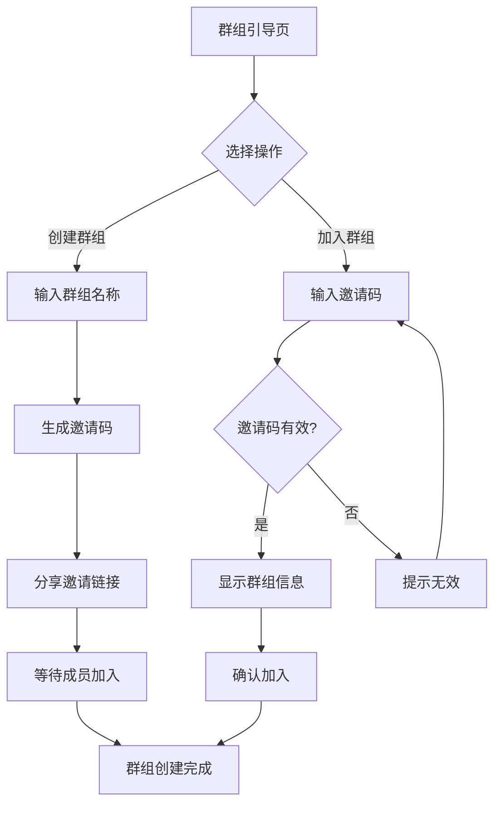
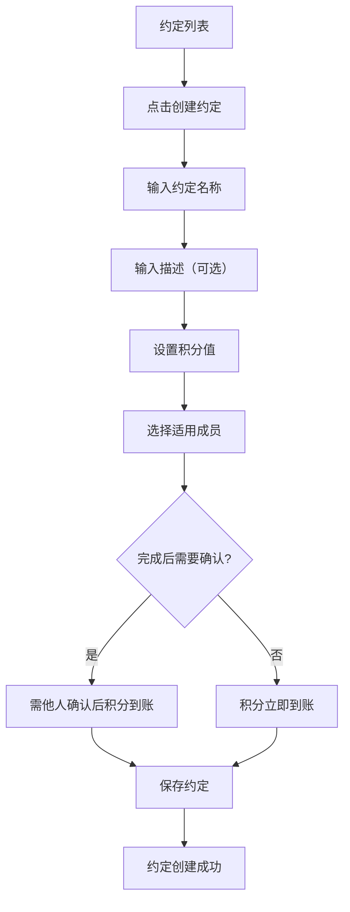
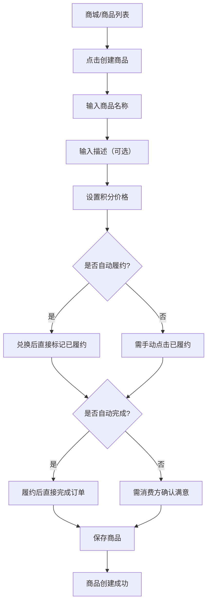
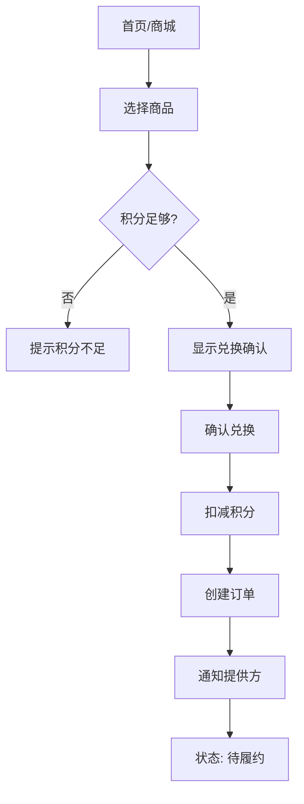

# UX Design Specification way2we

**Author:** Ziyuanhe
**Date:** 2025-12-29T10:09:22Z

---

<!-- UX design content will be appended sequentially through collaborative workflow steps -->

## Executive Summary

### Project Vision

way2we 是一款面向情侣与亲子关系的互动激励移动应用，通过“约定/规则 → 积分 → 兑换 → 履约确认”的闭环机制，把日常付出转化为可被看见、认可与回报的体验，帮助关系长期稳定与正向互动。

### Target Users

- 主要用户：同居/已婚情侣，以及孩子 6 岁以上的现代父母  
- 次要用户：可上网的孩子（6+）  
- 用户技术熟练度较低，主要使用 iPhone 与 Android 手机，在家中日常场景使用

### Key Design Challenges

- 让低技术熟练度用户也能轻松完成规则创建、积分记录与兑换确认  
- 情侣与亲子场景并存，权限控制既要精细又不能复杂  
- 日常高频使用场景下，操作需要足够轻量，避免打断生活节奏

### Design Opportunities

- 用即时反馈与情感化表达强化“被看见/被认可”的核心价值  
- 以积分与兑换进度的清晰可视化增强动力与持续性  
- 提供默认规则模板与简化引导，降低首次上手门槛

## Core User Experience

### Defining Experience

way2we 的核心体验围绕高频“完成约定”展开：用户日常完成健身、家务等约定并获得积分反馈。创建约定与设置商品也要足够轻松，但最关键的高频交互是“完成约定”，必须做到极致顺滑与零负担。

### Platform Strategy

仅做移动端 App，采用 Flutter；支持移动尺寸的 Web 版用于开发与测试，但正式发布仍为纯 App。主要触屏操作，设备能力侧重相册与通知，不需要离线能力。

### Effortless Interactions

需要做到“几乎不用思考”的动作包括：完成约定、兑换商品、确认约定/兑换。尤其是完成与确认必须顺滑高效；支持自动确认/自动完成的配置，以减少高频操作负担。

### Critical Success Moments

用户“兑换成功”是关键成功时刻，直接体现价值闭环。  
完成约定失败或兑换失败会严重破坏体验，是核心风险点。

### Experience Principles

- 以“完成约定”的高频操作为第一优先级，极简、顺滑、零负担  
- 兑换与确认流程必须稳定可靠，确保成功闭环  
- 配置自动化优先，减少重复确认与摩擦  
- 移动端触屏体验优先，流程短、反馈清晰

## Desired Emotional Response

### Primary Emotional Goals

- 被看见、被认可、有掌控感  
- 成就感与温暖感并存，愿意持续参与  
- 建立信任，感到公平与安心

### Emotional Journey Mapping

- 初次发现：好奇、被吸引，感觉“这能解决我的问题”  
- 核心操作中（完成约定/兑换）：顺畅、轻松、安心  
- 完成后：满足、被肯定、关系更亲近  
- 出错/失败时：被安抚、有清晰引导，不被责怪  
- 复访时：期待、信任、习惯化使用

### Micro-Emotions

- 自信 > 困惑  
- 信任 > 怀疑  
- 成就感 > 挫败  
- 愉悦/满足并重

### Design Implications

- 关键操作用清晰反馈和即时认可强化“被看见”  
- 失败场景提供温和解释与补救路径，降低挫败  
- 通过可视化进度和稳定规则建立信任感  
- 高频流程保持短路径与低认知负担

### Emotional Design Principles

- 以肯定与认可为默认语气，避免冷硬指令  
- 操作结果即时反馈，让用户持续获得正向情绪  
- 失败也给出尊重与支持，维持关系感与信任

## UX Pattern Analysis & Inspiration

### Inspiring Products Analysis

- TODO 类应用（高设计感/完成体验优秀的清单类）  
  - 优点：完成动作极简、反馈明确、进度清晰、使用成本低  
  - 价值：适合高频“完成约定”的核心动作设计
- 积分兑换类应用（多数体验不佳）  
  - 问题：流程冗长、层级复杂、界面信息噪声高、反馈不清晰  
  - 价值：提示我们要避免将“兑换”做得像复杂电商流程

### Transferable UX Patterns

- 完成动作一键化：完成约定应该像勾选待办一样顺滑  
- 低层级信息结构：减少步骤与页面跳转  
- 明确的即时反馈：完成后给予清晰确认与情感化反馈

### Anti-Patterns to Avoid

- 兑换流程过长、步骤过多  
- 信息堆叠导致用户难以找到核心操作  
- 视觉杂乱、过度促销化的积分商城体验

### Design Inspiration Strategy

**Adopt**
- TODO 类应用的“完成即反馈”与“低认知负担”模式

**Adapt**
- 把任务完成与积分反馈结合，但保持轻量化流程

**Avoid**
- 积分兑换类应用的复杂层级与视觉噪声

## Design System Foundation

### 1.1 Design System Choice

选择“可主题化设计系统”作为基础，组件与版式规范统一，但色彩提供多套主题选择。

### Rationale for Selection

- 团队设计能力较弱，需要成熟组件与交互模式保障质量  
- 希望有优秀设计且可快速落地，主题化系统更高效  
- 时间宽松，允许在色彩主题上精细打磨  
- 不开放用户自行调色，改为提供有限但高质量的色彩主题

### Implementation Approach

- 采用统一的字体、间距、圆角、阴影与组件结构规范  
- 预设 2-3 套完整色彩主题（主色、辅色、背景、文本、状态色）  
- 所有页面与组件依赖设计 token，确保一致性与可维护性

### Customization Strategy

- 只允许切换“色彩主题”，其余设计规范固定  
- 每套主题需匹配“温暖、被认可、信任”的情绪目标  
- 后续可基于用户反馈微调主题色，但不破坏整体规范

## 2. Core User Experience

### 2.1 Defining Experience

决定性核心体验是“完成约定并立即获得认可与积分反馈”。用户会把它描述为：在 app 里一键完成今天的约定（比如健身/家务），立刻得到积分与确认，让付出被看见。

### 2.2 User Mental Model

目前用户通常没有意识到“日常付出可被量化并兑现”，更多依赖口头沟通或模糊约定。  
他们期待的是“像勾选待办一样顺手”，不用复杂流程，就能确认和获得回馈。

### 2.3 Success Criteria

- 一键完成，无需多步确认  
- 反馈即时且清晰（积分变动、被认可的提示）  
- 不会失败或卡住，流程稳定可靠  
- 完成后明确知道“我成功了、积分到账了”

### 2.4 Novel UX Patterns

核心动作以“待办完成”这种成熟模式为主，用户无需学习新交互；  
创新点在于将“完成”与“认可/积分/兑换闭环”结合，但交互保持熟悉与轻量。

### 2.5 Experience Mechanics

**启动**：用户从首页/提醒进入“今日约定”列表  
**互动**：点击完成按钮/滑动完成动作  
**反馈**：即时积分增长 + 认可提示 + 状态变更  
**完成**：约定状态变为已完成，并可进入兑换或查看记录

## Visual Design Foundation

### Color System

采用可主题化的色彩架构，用户可切换预设主题。以下为第一套主题，后续将提供更多选择。

#### Theme 1: Warm Orange（温暖橙）

**Brand Colors**

| Token | 色值 | 用途 |
|-------|------|------|
| `primary` | `#ec8451` | 主操作、品牌色、强调元素 |
| `primary-dark` | `#d97544` | 按钮 hover/pressed 状态 |
| `primary-tint` | `rgba(236, 132, 81, 0.1)` | 次要按钮背景、选中态背景 |
| `primary-shadow` | `rgba(236, 132, 81, 0.3)` | 主按钮阴影 |

#### Background & Surface

| Token | 浅色模式 | 深色模式 | 用途 |
|-------|----------|----------|------|
| `background` | `#f8f6f6` | `#211611` | 页面背景 |
| `card` | `#ffffff` | `#2a201c` | 卡片背景 |
| `card-hover` | `#fafafa` | `#352924` | 卡片悬停/聚焦态 |
| `surface-muted` | `#ebe8e6` | `#2a201c` | 分段控件背景、次要表面 |

#### Text Colors

| Token | 浅色模式 | 深色模式 | 用途 |
|-------|----------|----------|------|
| `text-main` | `#181311` | `#ffffff` | 标题、主要内容 |
| `text-muted` | `#886f63` | `#9ca3af` | 辅助信息、标签、占位符 |
| `text-placeholder` | `#9ca3af` | `#6b7280` | 输入框占位符 |

#### Semantic Colors

| Token | 色值 | 用途 |
|-------|------|------|
| `success` | `#22c55e` | 积分增加、完成确认 |
| `error` | `#ef4444` | 错误状态 |
| `warning` | `#f59e0b` | 警告状态 |
| `info` | `#3b82f6` | 信息提示 |

#### Border Colors

| Token | 浅色模式 | 深色模式 | 用途 |
|-------|----------|----------|------|
| `border-default` | `transparent` | `transparent` | 默认边框（无边框设计） |
| `border-focus` | `rgba(236, 132, 81, 0.5)` | `rgba(236, 132, 81, 0.5)` | 聚焦边框 |
| `border-subtle` | `#e5e7eb` | `#3d2e28` | 分隔线、微弱边框 |

### Typography System

#### Typeface

- **Primary**: Plus Jakarta Sans
- **中文回退**: PingFang SC (iOS) / Noto Sans SC (Android)

#### Font Weights

| 名称 | 数值 | 用途 |
|------|------|------|
| Regular | 400 | 正文 |
| Medium | 500 | 强调正文 |
| Bold | 700 | 标题、按钮 |
| ExtraBold | 800 | 大数字 |

#### Type Scale

| 层级 | 尺寸 | 字重 |
|------|------|------|
| Display | 48px | 800 |
| H1 | 20px | 700 |
| H2 | 18px | 700 |
| Body | 14-16px | 400-500 |
| Caption | 12px | 400 |
| Small | 10px | 700 |

### Spacing Scale

基于 4px 基础单位：

| Token | 值 |
|-------|-----|
| `space-1` | 4px |
| `space-2` | 8px |
| `space-3` | 12px |
| `space-4` | 16px |
| `space-6` | 24px |
| `space-8` | 32px |

### Border Radius

| Token | 值 | 用途 |
|-------|-----|------|
| `rounded-full` | 9999px | **主要样式**：按钮、输入框、头像、Pill 形组件 |
| `rounded-xl` | 24px | 大型卡片、Hero 区域 |
| `rounded` | 16px | 标准卡片 |
| `rounded-lg` | 8px | 小卡片、图标容器 |

> **设计决策**：way2we 采用全圆角（pill-shaped）设计风格，传达温暖、友好的视觉感受。主要交互元素（按钮、输入框）一律使用 `rounded-full`。

### Shadow

| Token | 值 | 用途 |
|-------|-----|------|
| `shadow-primary` | `0 8px 24px rgba(236, 132, 81, 0.3)` | 主按钮阴影 |
| `shadow-soft` | `0 4px 20px -2px rgba(236, 132, 81, 0.15)` | 品牌色柔和阴影 |
| `shadow-card` | `0 2px 8px rgba(0, 0, 0, 0.05)` | 卡片阴影 |
| `shadow-sm` | `0 1px 3px rgba(0, 0, 0, 0.1)` | 小型组件阴影 |

### Iconography

- **图标库**: Material Symbols Outlined
- **标准尺寸**: 20px (输入框图标) / 24px (导航图标) / 32px (装饰图标)

## Internationalization (i18n)

### 多语言支持策略

way2we 支持中英双语，所有用户可见文本必须通过国际化系统管理，**禁止硬编码**。

#### 支持的语言

| 语言 | 代码 | 优先级 |
|------|------|--------|
| 简体中文 | `zh` | 主要语言 |
| English | `en` | 次要语言 |

#### 实现规范

1. **Flutter ARB 文件**: 使用 `l10n.yaml` 配置的 Flutter 国际化方案
   - 英文文件: `lib/l10n/arb/app_en.arb`（作为模板文件）
   - 中文文件: `lib/l10n/arb/app_zh.arb`

2. **命名规范**: 使用 camelCase，按功能模块分组
   ```
   auth_pageTitle          → 页面标题
   auth_registerTab        → 注册标签
   auth_loginTab           → 登录标签
   auth_emailPlaceholder   → 邮箱占位符
   ```

3. **动态文本**: 支持参数插值
   ```json
   "auth_stepIndicator": "Step {current} of {total}"
   ```

4. **语言切换**: 跟随系统语言设置，无需用户手动选择

#### 关键文本清单（示例）

| Key | English | 中文 |
|-----|---------|------|
| `auth_pageTitle` | Create your shared space | 创建你们的共享空间 |
| `auth_pageSubtitle` | Start tracking moments that matter together. | 开始记录你们的重要时刻 |
| `auth_registerTab` | Register | 注册 |
| `auth_loginTab` | Log In | 登录 |
| `auth_nicknameLabel` | Nickname | 昵称 |
| `auth_nicknamePlaceholder` | What should we call you? | 你想叫什么名字？ |
| `auth_emailOrPhoneLabel` | Email or Phone | 邮箱或手机号 |
| `auth_emailPlaceholder` | name@example.com | name@example.com |
| `auth_phonePlaceholder` | 13800138000 | 13800138000 |
| `auth_createAccountButton` | Create Account | 创建账号 |
| `auth_getVerificationCodeButton` | Get Verification Code | 获取验证码 |
| `auth_orContinueWith` | Or continue with | 或者通过以下方式继续 |
| `auth_joinWithInviteCode` | Join with Invite Code | 使用邀请码加入 |
| `auth_termsAgreement` | By continuing, you agree to our {terms} and {privacy}. | 继续即表示同意我们的{terms}和{privacy}。 |
| `auth_termsOfService` | Terms of Service | 服务条款 |
| `auth_privacyPolicy` | Privacy Policy | 隐私政策 |

## Design Direction Decision

### Design Directions Explored

基于产品定位和目标用户，探索了以下设计方向：
- 温暖、亲密的情感基调，适合情侣/家庭场景
- 现代简约的视觉风格，不花哨不幼稚
- 以快速操作为核心的首页布局
- 支持浅色/深色模式
- 支持多套可切换的主题色

### Chosen Direction

确定采用以下设计方向：

**整体设计主题**
- 横向滚动卡片布局，便于快速浏览和操作
- 积分卡片突出显示，大号数字强调成就感
- 字体 Plus Jakarta Sans，现代几何感，圆润友好
- 支持浅色模式与深色模式

**首套主题色：Warm Orange（温暖橙）**
- 主色 `#ec8451`，传达积极、温暖的情感
- 后续将提供更多主题色供用户切换

**输入框与按钮设计**
- 全圆角（pill-shaped）风格，视觉柔和友好
- 输入框使用白色背景、无边框设计，聚焦时显示品牌色边框
- 主按钮带品牌色阴影，增强点击感

### Design Rationale

选择此方向的原因：
1. **情感契合**：温暖橙色与产品"被看见、被认可"的核心价值高度一致
2. **操作优化**：横向滚动卡片支持单手快速操作
3. **扩展性**：主题色可切换，满足不同用户偏好
4. **技术可行**：基于 Token 的设计系统，便于 Flutter 实现

### Implementation Approach

- 构建统一的设计主题（布局、字体、组件规范）
- 主题色通过 Token 定义，支持切换
- 浅色/深色模式作为系统级配置
- 首页布局采用横向滚动卡片区 + 底部导航模式

## User Journey Flows

按用户实际操作顺序设计，简洁版流程（主流程 + 关键决策点）。

### 1. 注册与登录



### 2. 创建/加入群组



### 3. 创建约定



### 4. 创建商品

创建者即为提供方。



### 5. 记录完成约定

```mermaid
flowchart TD
    A[首页/约定列表] --> B[点击"记录"]
    B --> C[确认对话框]
    C --> D{约定配置需要确认?}
    
    D -->|否| E[积分即时到账]
    E --> F[显示成功反馈]
    F --> G[更新积分数字]
    
    D -->|是| H[创建待确认记录]
    H --> I[通知群组成员]
    I --> J[状态: 待确认]
    J --> K{成员确认结果}
    K -->|确认| E
    K -->|驳回| L[通知被驳回]
    L --> M[记录不生效]
```

### 6. 兑换商品



### 7. 履约与确认

```mermaid
flowchart TD
    A[提供方收到通知] --> B[查看订单详情]
    B --> C[履行服务/交付]
    C --> D[点击"已履约"]
    D --> E[状态: 待确认]
    E --> F[消费方收到通知]
    F --> G[消费方确认]
    G --> H{是否满意?}
    H -->|满意| I[订单完成]
    H -->|不满意| J[订单标记为不满意]
    J --> K[订单结束]
```

### Journey Patterns

**导航模式**
- 底部导航栏（首页、约定、兑换、我的）
- 关键操作从首页快速触达

**反馈模式**
- 即时操作：动效 + 数字变化
- 需确认操作：状态标签 + 通知提醒

**确认模式**
- 低成本操作（记录约定）：单次确认
- 高成本操作（兑换商品）：二次确认

## Component Strategy

### Design System Components

基础组件来源于 Flutter Material/Cupertino：

| 组件 | 来源 | 用途 |
|------|------|------|
| Button | Flutter Material | 主按钮、次要按钮 |
| Input | Flutter Material | 表单输入 |
| Card | 自定义样式 | 卡片容器 |
| Avatar | 自定义样式 | 用户头像 |
| Badge | 自定义样式 | 状态标签、通知徽章 |
| BottomNavigationBar | Flutter Material | 底部导航 |
| Dialog | Flutter Material | 确认对话框 |
| SnackBar | Flutter Material | 轻提示 |

### Custom Components

#### 卡片类组件

| 组件 | 位置 | 特点 |
|------|------|------|
| **AgreementCardCompact** | 首页横向滚动 | 紧凑版，带封面、名称、积分、Record 按钮 |
| **AgreementCardFull** | 约定列表页 | 完整版，含描述、适用成员、确认状态、置顶标识 |
| **RewardCardCompact** | 首页横向滚动 | 紧凑版，带封面、名称、价格、Redeem 按钮 |
| **RewardCardFull** | 商城列表页 | 完整版，含描述、提供方、配置状态 |
| **OrderCard** | 订单列表 | 订单信息、状态、操作按钮 |

#### 首页专用组件

| 组件 | 用途 |
|------|------|
| **PointsCard** | 积分展示卡片（渐变背景、大数字） |
| **ActivityItem** | 动态列表项（头像、事件、时间、积分变动） |
| **SectionHeader** | 区块标题（标题 + View All 链接） |

#### 表单组件

| 组件 | 用途 |
|------|------|
| **FormInput** | 通用文本输入 |
| **FormTextArea** | 多行文本（描述） |
| **PointsInput** | 积分数值输入 |
| **MemberSelector** | 成员选择器（多选） |
| **ToggleSwitch** | 开关（需他人确认/自动履约/自动完成） |
| **QuantitySelector** | 兑换数量选择器 |

#### 状态与反馈组件

| 组件 | 用途 |
|------|------|
| **StatusBadge** | 状态标签（待确认/已完成/待履约等） |
| **PointsChange** | 积分变动显示（+50 绿色 / -100 灰色） |
| **NotificationBadge** | 通知红点 |
| **EmptyState** | 空状态提示 |
| **ConfirmDialog** | 确认对话框 |

### Key Component Specifications

#### AgreementCardCompact

```
┌─────────────────────────────┐
│  [封面图/图标区 h-32]        │
│                    [+20 pts]│  ← 右上角积分徽章
├─────────────────────────────┤
│  约定名称 (Bold)             │
│  分类标签 (Muted)            │
│  ┌─────────────────────┐    │
│  │     Record          │    │  ← 主按钮
│  └─────────────────────┘    │
└─────────────────────────────┘
宽度: 260px | 圆角: 8px
```

**状态**: Default / Hover (封面放大 1.05) / Pressed (按钮 scale 0.95)

#### AgreementCardFull

```
┌───────────────────────────────────────┐
│ [图标] 约定名称              [+20 pts]│
│        分类标签                       │
├───────────────────────────────────────┤
│ 描述文字（最多两行）                   │
├───────────────────────────────────────┤
│ 👤 适用: 全部成员  ✅ 已完成 12 次    │
├───────────────────────────────────────┤
│ [详情]                    [记录完成]  │
└───────────────────────────────────────┘
宽度: 100% - padding | 圆角: 12px
```

#### RewardCardCompact

```
┌───────────────────┐
│ [封面图 h-28]      │
│ [分类标签]         │  ← 左下角
├───────────────────┤
│ 商品名称           │
│ 500 pts   [Redeem]│
└───────────────────┘
宽度: 200px | 圆角: 8px
```

#### PointsCard

```
┌────────────────────────────────────────┐
│  [徽章] Relationship Health            │
│                                        │
│           1,250                        │  ← 48px ExtraBold
│        Points Available                │
│  ════════════════════                  │  ← 进度条（可选）
│     Keep the love flowing!             │
└────────────────────────────────────────┘
宽度: 100% - padding | 圆角: 16px | 背景: 主题色渐变
```

#### StatusBadge

| 状态 | 颜色 | 文案 |
|------|------|------|
| pending | 主题色浅底 | 待确认 |
| completed | 绿色浅底 | 已完成 |
| awaiting_fulfill | 橙色浅底 | 待履约 |
| rejected | 灰色浅底 | 已拒绝 |

### Component Implementation Strategy

**构建原则**
- 所有自定义组件基于 Visual Design Foundation 的 Token
- 使用 Flutter Widget 封装，支持主题色切换
- 卡片组件支持骨架屏加载态
- 组件设计遵循原子设计原则（Atoms → Molecules → Organisms）

**实现顺序**
1. 基础 Token（颜色、字体、间距）
2. 原子组件（按钮、输入框、标签）
3. 分子组件（卡片、列表项）
4. 有机体组件（完整区块、页面布局）

## UX Consistency Patterns

### Button Hierarchy

| 类型 | 样式 | 使用场景 |
|------|------|----------|
| **Primary** | 主题色填充 + 白字 | 页面主操作（记录、兑换、保存） |
| **Secondary** | 主题色浅底 + 主题色字 | 次要操作（Redeem、详情） |
| **Ghost** | 透明底 + 边框 | 取消、返回、辅助操作 |
| **Disabled** | 灰色 + 不可点击 | 条件不满足时 |

**层级规则**
- 每个视图最多一个 Primary 按钮
- Primary 置于右侧或底部
- 破坏性操作需二次确认

### Feedback Patterns

| 场景 | 反馈方式 | 示例 |
|------|----------|------|
| **即时成功** | SnackBar + 数字动效 | 记录完成，积分 +50 |
| **需等待** | 状态标签 + 通知 | 待确认 → 已完成 |
| **错误** | SnackBar (红色底) | 网络错误，请重试 |
| **积分不足** | Toast + 按钮置灰 | 积分不足，无法兑换 |
| **加载中** | 骨架屏 or 按钮 Loading | 页面加载、提交中 |

**反馈原则**
- 积分变动必有视觉反馈（数字跳动、颜色变化）
- 错误提示具体且可操作
- 需等待的操作显示明确状态

### Form Patterns

| 场景 | 行为 |
|------|------|
| **必填项** | 标签后加 * 号 |
| **实时验证** | 失焦时验证，红色边框 + 错误提示 |
| **提交验证** | 滚动到第一个错误项 |
| **提交中** | 按钮显示 Loading，禁用重复提交 |
| **提交成功** | 返回上一页 + SnackBar 提示 |

### Navigation Patterns

| 模式 | 行为 |
|------|------|
| **底部导航** | 4 Tab，当前 Tab 高亮，点击切换 |
| **页面跳转** | 右滑进入，左滑返回（iOS 风格） |
| **返回** | 左上角返回箭头，或手势返回 |
| **深链接** | 从通知进入具体订单/约定 |

### Empty States & Loading

| 状态 | 展示 |
|------|------|
| **空列表** | 插画 + 说明文案 + 引导按钮 |
| **加载中** | 骨架屏（卡片形状占位） |
| **加载失败** | 错误插画 + 重试按钮 |
| **网络断开** | 顶部横幅提示 |

**空状态文案**
- 约定列表为空：「还没有约定，创建第一个吧」
- 商城为空：「还没有商品，添加一个奖励」
- 动态为空：「开始记录你的第一个约定吧」

### List & Scroll Patterns

| 模式 | 行为 |
|------|------|
| **横向滚动** | Snap 对齐，惯性滚动 |
| **纵向列表** | 下拉刷新，上拉加载更多 |
| **刷新反馈** | 顶部刷新动画 |
| **加载更多** | 底部 Loading 指示器 |

## Responsive Design & Accessibility

### Device Strategy

**仅支持手机竖屏**

| 支持 | 不支持 |
|------|--------|
| iPhone 14 / 14 Pro / 14 Pro Max | 平板 |
| 小米 14 及同尺寸安卓手机 | 桌面/Web |
| 竖屏模式 | 横屏模式 |

### Screen Sizes

现代主流手机尺寸接近，统一设计：

| 参考设备 | 尺寸 | 说明 |
|----------|------|------|
| iPhone 14 | 390×844 pt | 设计基准尺寸 |
| iPhone 14 Pro Max | 430×932 pt | 大屏兼容 |
| 小米 14 | 412×915 dp | Android 参考 |

**无需多断点**：现代手机宽度集中在 390-430 pt，差异不大，统一一套设计即可。

### Safe Areas

仅需处理：
- 顶部：刘海屏/挖孔屏状态栏区域
- 底部：Home Indicator / 手势条区域

使用 Flutter `SafeArea` Widget 自动适配。

### Accessibility Strategy

**目标：WCAG 2.1 AA 级别**

| 类别 | 要求 |
|------|------|
| **色彩对比** | 文字与背景对比度 ≥ 4.5:1 |
| **触控目标** | 可点击区域 ≥ 44×44 dp |
| **屏幕阅读器** | 所有交互元素有 Semantics 标签 |
| **动效** | 尊重系统「减少动态效果」设置 |
| **字体缩放** | 支持系统字体大小设置 |

### Testing Strategy

| 测试项 | 方法 |
|--------|------|
| 屏幕阅读器 | VoiceOver (iOS) / TalkBack (Android) |
| 安全区域 | iPhone 真机 + Android 真机 |
| 颜色对比 | Figma 插件检查 |
| 字体缩放 | 系统设置放大到最大 |
