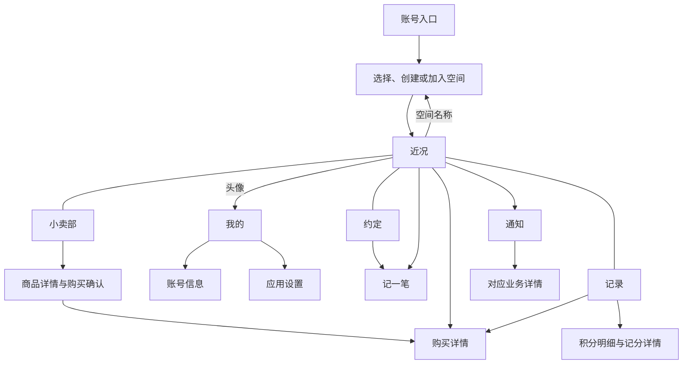

# 页面结构与交互草图

状态：阶段 2.1 已完成。首页与主导航、“约定与记分”“小卖部与购买”两条核心流程均已确认，作为关键页面视觉设计与可点击原型的依据。具体布局适配和状态反馈在后续原型与实现中验证。

设计模式：Operate，帮助成员理解当前情况并完成日常操作。业务依据为[产品规则](../product/rules.md)，场景依据为[业务验收场景](../product/acceptance-scenarios.md)，产品背景见 [PRODUCT.md](../../PRODUCT.md)。

本稿以文字线框表达信息层级、入口和反馈。阶段 2.2 已选定带顶部文案和植物装饰的视觉方向；颜色、字体、图标和控件外观按[主题与配色](themes.md)及关键页面设计图细化。

## 1. 导航与页面地图

底部提供四个固定入口：**近况、约定、小卖部、记录**。它们共用当前选中的空间。首页左上角为头像与“我的”入口，中间为空间名称及切换入口，右侧为通知入口；记分放在页面内。

| 入口 | 帮助用户回答的问题 | 下一级页面 |
| --- | --- | --- |
| 近况 | 最近发生了什么，我现在可以做什么？ | 快捷记分、待处理交易、成员与余额、最近记录 |
| 约定 | 我们有哪些约定，这次按哪一条记分？ | 约定详情、新建与编辑、修改记录、记分 |
| 小卖部 | 可以买什么，我的店里有什么？ | 店铺、商品或服务详情、购买确认、我的商品管理 |
| 记录 | 积分为什么变了，购买处理到哪一步了？ | 积分明细、记分详情、购买记录与详情 |
| 顶部空间名称 | 当前在哪个空间，如何切换或管理？ | 空间选择、创建与加入、成员、邀请、空间设置、退出与恢复 |
| 顶部通知入口 | 有什么需要我了解或处理？ | 当前空间站内通知、对应业务详情 |
| 首页左上角头像／我的 | 如何管理自己的账号和应用设置？ | 我的、账号信息、应用设置、退出登录；具体登录方式在工程方案中确定 |



空间选择页将当前参与的空间与可恢复的空间分别展示。切换空间后回到该空间的近况，导航、积分、店铺和记录一并切换；正在编辑时保留当前页面，让用户先完成或放弃编辑再切换。

## 2. 首页线框：近况

以下演示内容均为虚构。空间名为“一起的小日子”，成员为“阿禾”和“小满”，进入首页时阿禾为当前账号。首页示例处于购买两份早餐之后，余额为 10 分。

```text
[头像·我的]    一起的小日子 ▾    [通知]

平凡的日常，                    [主题装饰图]
也是值得好好记录的生活。
                         一起，让日子更温柔一点。

阿禾（我）  10 分         小满  0 分
查看积分明细                    查看成员

[ 记一笔 ]

待处理                           查看全部
准备一份早餐 × 2              [完成] [取消]
小满提供 · 我已支付 20 分

空间近况                         全部记录
今天 08:40
阿禾购买小满的早餐 × 2           −20 分
今天 08:30
阿禾为自己记录「散步 30 分钟」    +10 分

近况       约定       小卖部       记录
```

首页优先展示当前空间、个人余额、记分入口和与本人有关的待完成购买。成员余额可进入对应明细；多人空间展示本人和成员入口，完整成员列表在下一级页面查看。

顶部文案与右侧装饰承接已选视觉方向，配色和装饰图随个人主题一起变化。该区域按屏幕与字体大小调整，为文字和业务操作保留清楚的阅读与触控空间。

“待处理”合并列出本人作为买方或卖方参与、且当前可处理的待完成交易。每项显示商品或服务、数量、对方昵称、本人交易身份及实际支付积分，右侧始终展示“完成”“取消”按钮；点击内容区域仍可进入购买详情。

“完成”直接确认整笔完成；“取消”直接进入该笔交易的退款确认，显示退款对象和实际金额，确认后整笔取消并退款。处理成功后该项移出待处理区，更新余额与记录并反馈结果；提交期间对应按钮显示处理中，双方同时操作时展示最终有效状态。

空间近况展示最近的业务记录，并关联到其来源；每条明确涉及成员、操作者、动作与时间。已撤销和已取消记录带文字状态，原积分变化与回退关联展示。

首次进入空空间时显示“邀请对方加入”和“创建第一条约定”。没有待处理交易时显示“暂无待处理交易”，并保留小卖部入口。首页列表展示少量最近记录，“查看全部”进入本人待完成交易列表，完整历史从“记录”进入。

首页左上角头像与“我的”文字共同构成入口，点击进入账号级页面。空间名称负责切换及管理当前空间，通知入口负责查看站内消息。

### 我的与设置

```text
‹ 我的

账号信息                          ›
应用设置                          ›

退出登录
```

“我的”集中管理账号与应用设置；当前空间的昵称、成员、邀请和退出由空间管理负责。进入“我的”后保留当前空间选择，返回时回到原首页。退出登录结束当前登录会话，空间成员身份和业务数据继续保留。

已登录但尚未参与任何空间时，空间选择页也提供相同的头像／我的入口，方便访问账号与设置。

“应用设置 → 外观”提供主题名称、配色色块与装饰预览，点击选择并保存，当前项显示勾选。主题属于个人，切换空间后沿用本人选择；返回时保持原页面位置，业务数据和正在填写的内容继续保留。具体方案见[主题与配色](themes.md)。

## 3. 约定与记分线框

主要路径：**约定列表 → 新建或查看约定 → 记一笔 → 原入口查看结果**。误记时从结果提示、首页近况或积分明细进入记分详情撤销。

### 列表与约定详情

```text
约定                              新建
生效中 / 已停用           适用成员：全部 ▾

散步 30 分钟                     +10 分
适用于 阿禾、小满
查看详情                       [记一笔]

乱放鞋子                          −5 分
适用于 阿禾、小满
查看详情                       [记一笔]

近况       约定       小卖部       记录
```

默认展示生效中的约定，可切换查看已停用约定。点击一行的内容进入详情，点击右侧“记一笔”直接进入记分表单。适用成员筛选帮助多人空间查找约定，列表始终显示该约定适用于谁。

约定详情按名称、分值、行为说明、适用成员和最近修改信息排列。主要操作是“记一笔”，编辑从右上角进入，停用与修改记录放在详情的管理区域。当前空间成员按已确认权限操作；停用后，详情展示停用状态及历史。

### 创建与修改约定

```text
‹ 新建约定

约定名称
散步 30 分钟

说明（选填）
一起出门散步，累计满 30 分钟。

适用成员
[✓] 阿禾（我）    [✓] 小满

积分变化
[加分]  扣分           分值 [10] 分

[ 保存约定 ]
```

适用成员由创建者明确选择，至少选择一名当前成员。选中“加分”或“扣分”后，输入分值并显示对应的正负号预览。必填信息缺失时在字段旁说明需要补充什么。

新建和编辑使用同一个表单。新建保存成功后进入约定详情，可立即“记一笔”；修改保存成功后回到详情，显示最新规则及修改人、时间。修改记录按修改前后的内容成对展示，历史记分继续使用发生时的内容和分值。

停用在约定详情发起，提示“停用后暂停新的记分，历史记录保留”，确认后更新详情及列表。放弃未保存的编辑时，提示继续编辑或放弃修改；保存失败保留已填写内容，允许重试。

### 记一笔

首页的“记一笔”先选择生效中的约定，约定列表中的“记一笔”直接带入当前约定，随后使用同一个简短表单。以下示例为第三次记录散步，记录前余额为 20 分：

```text
记一笔                             关闭

按哪条约定
散步 30 分钟                      更换

给谁记分
阿禾（我） ▾

本次积分变化                    +10 分
阿禾的余额                      20 → 30 分

[ 给阿禾加 10 分 ]
```

- 本人是适用成员时默认选本人；只有一名可选成员时默认选该成员；其他情况要求选择。可选范围为当前参与空间且适用该约定的成员。
- 每次提交对应一名成员的一条记分。按钮明确成员与实际加减分值。
- 保存成功后回到入口页面，刷新余额和近况，提示“已给阿禾加 10 分”，附“查看记录”。继续记分会形成新记录。
- 本次分值取自所选约定，选择成员时同步显示该成员余额和本次影响。提交即完成记分，成功反馈与历史记录用于核对结果。

### 查看与撤销记分

```text
‹ 记分详情

散步 30 分钟                     +10 分
记分对象                         阿禾
操作者                           阿禾
发生时间                         今天 08:30
当时余额                         20 → 30 分

[ 撤销这笔记分 ]
```

当前成员均可从有效记分详情发起撤销，确认区展示原分值、回退方向与记分对象的当前余额变化。示例中，阿禾购买早餐后余额为 10 分，此时撤销原来的 +10 分，确认区显示：

```text
撤销这笔记分？
散步 30 分钟 · 阿禾 · 原记分 +10 分
本次回退 −10 分，阿禾当前余额 10 → 0 分。

[ 保留记分 ]             [ 确认撤销 ]
```

撤销成功后留在详情，状态变为“已撤销”，关联展示原记分及撤销人、时间和回退值。原积分变化与回退分别保留在明细中；约定后来改分也按原值撤销。当前余额可能因回退变为负数，确认区按实际结果展示。

### 这条流程的反馈

| 操作 | 提交后的位置 | 用户看到的结果 |
| --- | --- | --- |
| 新建约定 | 约定详情 | 约定已生效，可立即记一笔 |
| 修改约定 | 原约定详情 | 最新内容及修改记录，历史记分保留 |
| 记一笔 | 发起操作的首页或约定页 | 更新后的余额或相关记录，以及可进入详情的成功提示 |
| 撤销记分 | 记分详情 | 已撤销状态、实际回退值及完整经过 |

## 4. 小卖部与购买线框

主要路径：**店主添加商品或服务 → 空间成员查看 → 选择数量并购买 → 双方在待处理中完成或取消**。“逛小卖部”和“我的店铺”共用底部的小卖部入口。

### 逛小卖部

以下示例处于三次散步记分完成后、购买早餐之前，余额为 30 分。

```text
小卖部                       可用 30 分
逛小卖部 / 我的店铺

小满的小卖部
准备一份早餐
商品或服务说明                  10 分 / 份
                               查看详情

陪你看一场电影
商品或服务说明                  20 分 / 份
                               查看详情

近况       约定       小卖部       记录
```

两人空间直接展示对方的小卖部；多人空间增加店主选择。当前账号的经营入口固定为“我的店铺”，其中展示本人商品及其上下架状态，并提供添加、编辑和上下架操作。

### 经营我的店铺

以下以小满的账号查看自己的店铺：

```text
小卖部                             添加
逛小卖部 / 我的店铺

准备一份早餐                     10 分 / 份
已上架                         [编辑] [下架]

陪你看一场电影                   20 分 / 份
已下架                         [编辑] [上架]

近况       约定       小卖部       记录
```

添加与编辑使用一个表单，店主填写名称、说明、可选图片和积分单价。首版商品与服务沿用同一套内容和履行方式。

```text
‹ 添加商品或服务

名称
准备一份早餐

说明（选填）
一份热乎的早餐，时间一起商量。

图片（选填）                     添加图片
积分单价                         [10] 分 / 份

[ 保存并上架 ]
```

新增成功后回到“我的店铺”，新项目显示已上架。编辑已有项目时按钮为“保存修改”，保留当前上下架状态；下架暂停新的购买，已产生购买继续按购买时信息履行。列表右侧提供上架或下架快捷操作，操作结果就地更新。

空店铺展示“添加第一件商品或服务”；查看其他成员的空店铺时，说明对方还未上架内容。编辑失败保留输入，图片处理期间提示进度，完成保存前保留当前表单。

### 商品详情与购买

商品详情展示店主、标题、说明、可选图片、当前单价与上架状态，底部提供“购买”。点击后在当前页面弹出购买确认，集中展示数量和积分影响：

```text
购买确认                           返回

小满 · 准备一份早餐
单价                           10 分 / 份
数量                          [−]  2  [+]

合计支付                         20 分
当前余额                         30 分
购买后余额                       10 分

[ 支付 20 分购买 ]
```

数量初始为 1，可递增或直接输入正整数。余额不足时，合计旁明确提示“还差 10 分”，保留数量修改，并提供查看积分和约定的入口。商品下架或店主退出时，页面说明当前状态并刷新可购买内容。

“支付 20 分购买”直接提交，提交期间显示处理中。支付前若价格或商品内容已变化，更新内容与合计，由用户根据新信息再次提交；网络超时先确认本次结果或重试同一次操作，成功后刷新实际余额。

购买成功后进入购买详情，展示实际扣分及待完成状态。后续详情使用购买时保存的内容、单价和数量。关闭购买确认回到商品详情，返回列表保留所选店铺。

## 5. 购买详情与双方视角

```text
‹ 购买详情

待完成
准备一份早餐 × 2
阿禾购买 · 小满提供
10 分 × 2                    已支付 20 分

购买经过
今天 08:40  阿禾购买，扣除 20 分

全部商品或服务提供后，可确认完成。
[ 确认整笔完成 ]
取消购买并退还 20 分
```

| 当前状态与查看者 | 页面动作与反馈 |
| --- | --- |
| 待完成，买方或卖方查看 | 双方均可整笔确认完成或取消退款；查看者身份改变称谓，金额和状态共用同一记录 |
| 已完成，买方或卖方查看 | 展示完成操作者与时间，保留整笔取消退款入口 |
| 已取消 | 展示原因、操作者或退出触发者、退款对象、金额与时间，保留完整经过 |
| 其他当前成员查看 | 查看交易双方、积分与历史，操作入口按本人交易身份展示 |

确认完成后更新整笔状态，向另一方发送站内通知。取消时使用一个明确的确认步骤：“取消这笔购买，向阿禾退还 20 分”，确认按钮为“取消并退款”。提示按整笔退款，已提供部分商品或服务也遵循同一规则。

```text
取消这笔购买？
准备一份早餐 × 2
退款对象                              阿禾
退还积分                             20 分
整笔取消，已提供部分内容也全额退款。

[ 保留购买 ]             [ 取消并退款 ]
```

首页“待处理”和购买详情共用相同的完成、取消行为。首页直接完成后就地移除该项并反馈“已完成”；从首页取消时，就地展示上述确认，成功后更新列表和余额。从详情操作则留在详情展示最新状态。

已完成购买仍可从“记录”进入详情取消，退款金额始终取实际支付值。已取消记录显示退款对象、金额、时间与完整经过。另一方先完成或取消时，当前页面刷新为实际状态，已生效的退款保持一次。

退出导致的自动取消在购买经过中注明“因小满退出空间，购买已取消，向阿禾退还 20 分”。原购买曾完成时保留完成经过；自动退出处理的范围为待完成购买。

### 这条流程的反馈

| 操作 | 提交后的位置 | 用户看到的结果 |
| --- | --- | --- |
| 保存并上架 | 我的店铺 | 新项目处于已上架，可继续编辑或下架 |
| 购买 | 购买详情 | 实际支付积分、购买数量、待完成状态；双方首页出现该交易 |
| 首页完成或取消 | 首页 | 对应待处理项移除，结果提示、余额和近况更新 |
| 详情完成或取消 | 购买详情 | 最新状态及操作者、时间、退款等完整经过 |

## 6. 记录、通知与成员入口

| 页面 | 信息层级及主要操作 |
| --- | --- |
| 记录／积分明细 | 默认查看本人，可选择任何当前或历史成员；依次显示余额、每笔加减分与原因、时间、来源详情。购买扣分与退款各有记录，并能回到购买详情 |
| 记录／购买记录 | 默认显示与本人有关的购买，可筛选我买的、我提供的或空间全部购买，再按待完成、已完成、已取消筛选 |
| 通知 | 展示当前空间的本人站内通知，已读和未读可区分；点击进入对应业务详情。具体事件覆盖沿用通知模块设计与后续通知清单 |
| 我的／应用设置 | 从首页左上角头像进入，管理账号信息与应用设置，提供退出登录；返回时保持当前空间 |
| 成员列表 | 展示昵称、当前参与状态及空间内余额，进入成员明细；提供邀请入口，当前账号可编辑自己的空间昵称 |
| 邀请详情 | 新人查看空间与邀请信息并接受；当前成员查看新人接受状态和各成员同意进度，按规则完成加入 |
| 空间设置／退出 | 提示涉及本人的待完成购买将取消，并分别列出自己收到的退款及退给其他买方的积分；确认后进入空间选择页 |
| 空间选择／恢复 | 已退出空间提供“重新加入”；恢复后进入近况，余额与历史沿用当前保留值，已取消购买显示原取消结果 |

当前空间内操作和查看的前提是仍在参与。访问已经退出空间的业务详情时，提供返回空间选择及恢复参与入口。

## 7. 一条完整操作路径

所有昵称与内容均为演示数据；原型的双方视角共用一套数据。切换演示身份的控件放在原型外部。

1. 阿禾创建空间、邀请小满；邀请双方条件满足后，小满进入同一空间，两人初始余额均为 0。
2. 阿禾新建“散步 30 分钟，+10 分”，适用于双方；在约定页与首页均可找到记分入口。
3. 阿禾分三次记录散步，余额达到 30 分；小满从空间近况与记录中能看清三次变化。
4. 小满在“我的店铺”添加“准备一份早餐，10 分／份”；阿禾在“逛小卖部”购买 2 份，立即扣除 20 分，余额为 10 分。
5. 阿禾和小满都在首页“待处理”看到同一笔购买，右侧可以直接完成或发起取消。任意一方确认整笔完成，双方列表同步更新，另一方从通知进入详情。
6. 分支演示：撤销原记分、取消已完成购买，以及待完成购买因任意一方退出而整笔取消；每次都能从记录解释余额变化。

各线框分别展示这条路径中的记分前、购买前和购买后状态；可点击原型随连续操作刷新所有页面，保持双方视角的数据一致。

## 8. 关键状态与移动端要求

| 状态 | 交互要求 | 对应验收 |
| --- | --- | --- |
| 等待加入 | 显示本人接受与现有成员同意进度，满足条件后进入空间 | S02 |
| 空间与成员切换 | 始终能辨认当前空间、查看的是谁的余额，以及谁可操作 | S01、S03、S04 |
| 约定变更或停用 | 提交前核对最新有效规则，内容变化时展示新分值再由用户提交；历史详情保持原值 | A04、A06、A09 |
| 负余额及余额不足 | 负数正常展示；购买确认显示缺口，保留修改数量与查看积分的入口 | A05、A07、P03 |
| 多份购买 | 展示单价、数量、总价；完成和退款均表达为整笔 | P02、P07、P11、P12 |
| 撤销与退款 | 操作前说明实际回退分值及对象；完成后显示相关历史 | A06、A08、P08、P10 |
| 网络不可用 | 显示联网要求和重试入口，保留当前表单输入，恢复连接后刷新数据 | 联网业务约束 |
| 提交中或结果待确认 | 同一次提交保持处理中；超时后查询结果或重试同一次操作，得到确定结果后再刷新余额 | C01、C04 |
| 双方同时操作 | 服务端返回当前有效状态；已完成或已取消时展示结果，余额不足时提示实际缺口 | C02、C03、P10 |
| 退出与恢复 | 明确自动取消和各买方退款金额，恢复后展示保留数据 | S05—S07、L01—L06 |

手机端共用品牌和页面结构，返回、弹出任务、安全区域和键盘避让适配 iOS 与 Android。常用操作触控区域按各平台要求设计；文字随系统阅读设置放大，长昵称和约定名称换行或在详情完整显示。加分、扣分、停用和取消均有明确文字，颜色作为辅助。

阶段 2.2 会将上述层级应用到关键页面视觉稿，阶段 2.3 验证手机尺寸下的点击路径和状态反馈；原生系统行为在 Flutter 双端实现时使用模拟器和实际设备验证。

## 9. 已确认的交互与后续设计

首页左上角头像进入“我的”，顶部空间名称负责空间管理，右侧为通知；底部保留近况、约定、小卖部、记录四个入口。首页待处理交易采用合并列表与右侧完成、取消按钮，以上结构已确认。

两条核心流程已确认以下交互，表单、入口、返回位置和结果反馈见前文：

1. 约定列表直接“记一笔”，适用时默认选本人，提交按钮明确实际成员与分值；误记从记录详情撤销。
2. 小卖部内切换“逛小卖部／我的店铺”，店主保存新内容后直接上架，编辑保留原上下架状态。
3. 从商品详情展开购买确认，选择数量并查看合计后一次提交；首页可直接完成交易，取消就地确认实际退款。

下一步以同一条双人示例流程设计首页、约定、小卖部和购买详情，先生成关键页面设计图，选定视觉风格后制作可点击原型。视觉阶段使用本稿中已经确认的信息层级与操作方式。
