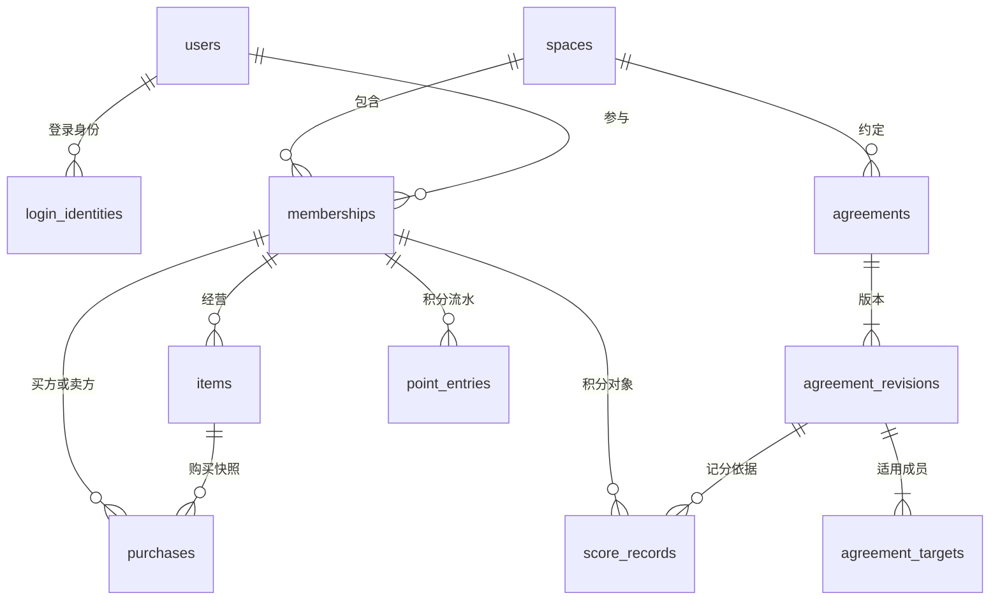

# 数据模型与事务设计

状态：阶段 3.2 实施设计，依据已采纳工程基线及产品规则。T00—T02 已迁移账号、邮箱验证码与会话、空间与成员、命令、邀请与同意、空间审计、通知事件与站内通知表；约定、积分流水、购买及图片表随对应业务任务迁移。

## 基本类型与归属

业务主键使用 UUID，API 将其作为不透明字符串。时间列使用 `timestamptz`，服务端生成发生时间。积分、数量及计算中间值使用 `bigint`，API 的积分值约束在 ±9,007,199,254,740,991 内，并检查运算溢出。

空间相关表均携带 `space_id`。成员在一个空间中有稳定的 `member_id`，退出和恢复只改变状态；业务记录引用成员，账号用于登录及当前操作者鉴权。跨表关系使用包含 `space_id` 的复合外键，保证约定、商品、购买和成员属于同一空间。

## 账号与登录

| 表 | 主要字段 | 约束与用途 |
| --- | --- | --- |
| `users` | id、display_name、theme、created_at、updated_at | theme 为个人主题；新账号默认暖杏 |
| `login_identities` | id、user_id、provider、subject、verified_at | `(provider, subject)` 唯一；首版 provider 为 email |
| `email_challenges` | id、email_normalized、code_hmac、attempt_count、expires_at、consumed_at、invalidated_at、delivery_state | 每份验证码独立记录；同邮箱的签发、失效与尝试次数更新串行执行 |
| `sessions` | id、user_id、token_hash、created_at、expires_at、revoked_at | token_hash 唯一；明文凭据仅签发给客户端 |

首版邮箱输入为 ASCII 地址，去除首尾空格并统一小写；身份键与发送目标使用同一规范值，保留点和 `+` 标签。验证邮箱控制权后，再建立或取得唯一的内部账号。显示昵称由用户设置，与邮箱独立；首次登录使用可修改的通用昵称。

验证码申请返回统一的已受理结果，客户端用邮箱和六位验证码验证。验证码发送通过独立发送流程执行，发送结果及供应商幂等标识记录在 challenge；可恢复投递需要的验证码材料加密保存，到期后清除。发送重试沿用同一份有效 challenge，重新申请才使旧 challenge 失效。

同邮箱签发使用数据库事务级锁协调。验证时锁定当前 challenge；错误尝试增加计数，达到上限后失效；正确验证码消费、账号建立／取得和会话创建在同一事务提交。30 天会话使用密码学随机生成的 32 字节凭据，数据库保存摘要。

未登录的验证码接口使用自身频控，业务命令的账号幂等表从登录后使用。验证码验证成功后若响应丢失，客户端可重新申请验证码并登录，身份唯一约束确保仍进入原账号；没有向客户端交付的旧会话按到期规则清理。

## 空间与成员

| 表 | 主要字段 | 约束与用途 |
| --- | --- | --- |
| `spaces` | id、name、created_by、created_at | 空间业务写入锁定此行 |
| `memberships` | id、space_id、user_id、nickname、status、balance、joined_at、left_at | `(space_id, user_id)` 唯一；status 为 active／left；初始 balance 为 0 |
| `invitations` | id、space_id、inviter_member_id、code_digest、code_ciphertext、expires_at、candidate_user_id、candidate_nickname、accepted_at、status | 高熵一次性邀请码；接受后绑定候选账号，状态 waiting／joined／expired |
| `invitation_approvals` | space_id、invitation_id、member_id、approved_at | `(invitation_id, member_id)` 唯一；发起邀请视为邀请人已同意 |

邀请码为随机 20 位 Base32 字符串，链接与手工输入共用同一凭据，初始有效期 7 天。服务端按摘要查找，凭据加密保存供创建结果重放。首次接受原子绑定当前账号；重复接受返回同一结果，其他账号使用已绑定凭据得到不可用反馈。未接受且到期的邀请转为 expired；已接受的申请继续等待同意。

邀请预览只返回空间名称与邀请人昵称，接受前可据此判断对象。邀请码放在 POST 请求正文；分享链接由客户端提取凭据，日志对链接和正文执行脱敏。未加入者只能查看自己申请的状态和同意进度，空间业务数据在正式加入后开放。

加入时在空间锁内读取当前 active 成员，所有这些成员同意后创建一条余额为 0 的成员记录。新的当前成员也进入同意范围；已退出成员不计入。多个申请按接受时间及 ID 固定顺序核验，每次加入后重新读取成员集合。同一候选账号的多个待处理邀请合并到已有申请，历史成员走直接恢复流程。

用户已确认：全部当前成员退出时，已接受的申请保持等待；至少有一名历史成员恢复参与后，再按当前成员集合核验同意条件。成员离开、恢复或新加入后均重新核验待处理申请。申请 joined 后保存入场时的同意名单，后续查询按该快照展示。

## 约定、记分与店铺

| 表 | 主要字段 | 约束与用途 |
| --- | --- | --- |
| `agreements` | id、space_id、current_revision、status、created_at | active／disabled；当前版本指向有效定义 |
| `agreement_revisions` | space_id、agreement_id、revision、title、description、points_delta、changed_by、created_at | `(agreement_id, revision)` 唯一，旧版本完整保留；分值为非零整数 |
| `agreement_targets` | space_id、agreement_id、revision、member_id | 版本内适用成员唯一；至少一人在业务层保证 |
| `score_records` | id、space_id、agreement_id、agreement_revision、subject_member_id、actor_member_id、points_delta、status、created_at、revoked_by、revoked_at | 一次提交为一名成员记一笔；状态 recorded／revoked；保存原分值 |
| `items` | id、space_id、owner_member_id、version、title、description、kind、unit_points、media_id、status、updated_at | goods／service；listed／unlisted；正整数单价；每次修改递增版本；店主拥有管理权限 |

约定编辑为下一次记分生成新版本；停用保留所有版本。记分在空间锁内使用当时有效版本并检查对象仍是当前适用成员。修改约定的业务历史可由版本和审计查看。

约定当前版本使用可延迟检查的复合外键，允许约定与首个版本在同一事务建立，并在提交时校验完整关联。

每个成员的店铺由其商品集合构成，空间成员状态决定店铺是否可购买。商品更新影响后续购买；购买记录复制当时内容和图片标识。历史图片通过已保存的引用保留。

商品引用图片时检查 ready 状态、所属空间及上传者为当前店主。图片最终解码验证与元数据清理在媒体流程完成，业务事务只引用已经可用的对象。

购买请求携带客户端展示的商品版本，事务内与当前版本比较。内容、价格或上下架状态变化后，客户端先展示最新内容，再让用户确认新的一次购买意图。

## 购买、流水与审计

| 表 | 主要字段 | 约束与用途 |
| --- | --- | --- |
| `purchases` | id、space_id、buyer_member_id、seller_member_id、item_id、item_snapshot、unit_points、quantity、paid_points、status、created_at、completed_by／at、cancelled_by／at、cancel_reason | 买卖双方不同；pending／completed／cancelled；单价与数量为正；paid_points 等于创建时乘积 |
| `point_entries` | id、space_id、member_id、kind、delta、balance_after、score_record_id、purchase_id、reverses_entry_id、actor_member_id、created_at | kind 为 score／score_reversal／purchase_debit／purchase_refund；按来源与种类唯一 |
| `audit_events` | id、space_id、actor_member_id、event_type、resource_type、resource_id、data、request_id、created_at | 追加记录，保存修改、完成、取消及退出原因，用于近况与历史 |

流水 `score`／`score_reversal` 指向记分记录，`purchase_debit`／`purchase_refund` 指向购买记录，两类来源互斥。撤销／退款关联原流水且 `reverses_entry_id` 唯一。购买扣分为负、退款为正，记分撤销为原分值的相反数；来源成员和空间须一致。

`balance_after` 是该成员该笔流水生效后的余额。成员余额等于其全部 delta 之和；跨行求和由事务写入规则、集成测试和核对查询验证。数据库 CHECK 只表达单行范围与状态条件，复合外键和唯一约束负责关联与去重。

## 操作结果与通知

| 表 | 主要字段 | 约束与用途 |
| --- | --- | --- |
| `commands` | actor_user_id、idempotency_key、operation_name、space_id、request_hash、result_status、http_status、response_body、resource_refs、created_at | `(actor_user_id, idempotency_key)` 主键；终态 succeeded／rejected；与业务一起提交 |
| `notification_events` | id、space_id、event_type、version、actor_user_id、recipient_ids、resource_ref、payload、request_id、status、attempts、available_at、lease_until | 事务内写入；worker 通过租约领取与恢复 |
| `notifications` | id、event_id、recipient_user_id、resource_ref、display_data、created_at、read_at | `(event_id, recipient_user_id)` 唯一；查询只返回当前账号可见内容 |
| `media_objects` | id、owner_user_id、space_id、purpose、storage_key、content_type、size_bytes、width、height、status、created_at | pending／ready／rejected；ready 对象才可被业务引用 |

命令保存终态响应及资源引用，重放时重新鉴权并生成新的请求编号。含邀请凭据的结果加密保存；一般业务结果保存 JSON 快照。当前角色失去空间权限后，普通命令结果不可读取；本人退出／恢复命令允许返回仅含成员 ID、空间 ID 和本人参与状态的结果，保证退出后的结果核对。

查不到命令返回 404 `OPERATION_NOT_FOUND`，含义为“尚无已提交结果”；原请求可能仍在执行。客户端继续使用原标识核对或提交。结果查询返回原 HTTP 状态和 JSON 结果，资源状态随后可以再次读取。

通知数据与投递状态分开。新事件版本保持可解析；进入资源前重新验证权限。退出空间后，相关业务通知从可读列表隐藏，恢复参与后重新按当前权限读取。面向待加入者的邀请进度通知按申请人身份授权。

首轮事件均采用版本 1：约定创建／修改、记分／撤销、购买成立／完成／取消通知提交时其他当前成员；加入与退出通知其余当前成员，申请进度通知候选人及需要同意的成员。商品编辑写审计供近况查询。事件在事务内固定接收者，读取时再校验当前权限。重复请求返回既有结果，不产生新事件；重复消费依靠事件与接收者唯一约束去重。

## 事务步骤

所有空间命令使用同一模式：开始事务 → 锁空间 → 检查操作者和命令指纹 → 已有结果则安全重放 → 读取当前状态 → 写业务、流水、审计、通知事件与命令结果 → 提交。业务写入前的确定性拒绝仅保存拒绝结果，业务写入后的失败整笔回滚。

| 操作 | 同一事务中的变化 |
| --- | --- |
| 创建空间 | 创建空间、创建当前账号成员及 0 余额、审计、命令结果；新空间在提交后可见 |
| 新成员加入 | 更新接受或同意进度，满足条件时创建成员、写加入审计与通知 |
| 记分 | 读取当前约定版本，创建记分、写 score 流水、更新对象余额、审计和通知 |
| 撤销记分 | 标记 revoked，以原分值写 score_reversal、更新原对象余额；已撤销则返回当前结果 |
| 购买 | 校验双方当前参与、商品上架和余额，复制快照、扣买方积分、写流水；卖方余额保持原值 |
| 完成购买 | pending 转 completed，记录操作者、审计和通知；已完成返回原结果，已取消报状态冲突 |
| 取消购买 | pending／completed 转 cancelled，退原 paid_points 给买方；已取消直接返回原结果 |
| 退出空间 | 找到本人作为买方或卖方的全部 pending 购买，按购买 ID 排序整笔取消和退款，再标记成员 left，保留原商品上下架状态；历史 completed 购买保持状态 |
| 恢复参与 | 将原成员置为 active，沿用其余额、历史和商品状态，重核加入申请 |

邀请接受、本人退出和恢复分别声明允许的操作者身份；普通接口统一要求 active 成员。已退出对象仍可获得历史撤销或退款，操作人必须按产品规则具有当前权限。

## 索引与读取

记录列表按 `created_at DESC, id DESC` 分页，约定版本按 revision 倒序，成员按加入时间与 ID 排序；游标绑定资源、空间和筛选条件。成员索引覆盖 `(user_id, status)`；购买覆盖空间及买方／卖方状态；流水覆盖 `(space_id, member_id, created_at, id)`；通知覆盖接收者与时间；worker 索引覆盖待处理状态和可领取时间。权限过滤先于分页，避免用计数或游标暴露受限通知。

首页读取成员、可处理的 pending 购买和最近审计，使用一致快照。`actionable_by_me=true` 只返回当前账号为买方或卖方且当前可处理的购买；全空间购买历史仍对当前成员可见。

主外键和唯一约束由迁移实施；命名写出表、字段及约束用途，便于 Go 按已知约束转换错误。数据库约束设计参考 [PostgreSQL 官方文档](https://www.postgresql.org/docs/current/ddl-constraints.html)。
